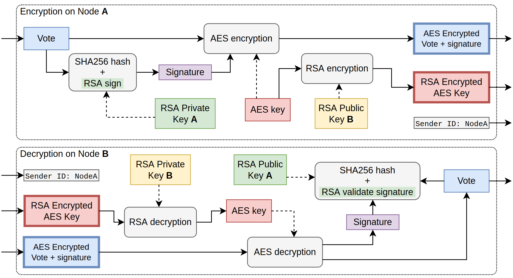

# Šifrovanie komunikácie

Bezpečnosť je vo voľbách, najmä v elektronických, prakticky najdôležitejším prvkom. Porušenie integrity volieb môže viesť k zmene výsledkov a v dôsledku toho k zvoleniu nesprávnych kandidátov.

<!--  -->

Keďže naše riešenie zahŕňa iba jeden centrálny server a hlasy z gateway-ov sú odosielané cez verejnú internetovú sieť, rozhodli sme sa použiť RSA a AES algoritmy na šifrovanie prenášaných hlasov. Samotné hlasy sú zašifrované pomocou symetrického kľúča AES, ktorý je potom zašifrovaný verejným kľúčom RSA hlavného serveru. Hlasy sú tiež podpísané  asymetrickým privátnym kľúčom RSA gateway-a, ktorý zabezpečí, že počas prenosu na server dáta neboli zmenené. Zapojením súkromného kľúča volebnej miestnosti sme zabezpečili, že aj keby útočník poznal verejný kľúč hlavného servera, potrebovali by poznať aj privátny kľúč konkrétnej volebnej miestnosti. Algoritmus AES sa používa kvôli jeho rýchlosti a schopnosti šifrovať správy neobmedzenej dĺžky a je v súčasnosti priemyselným štandardom. Rovnaký proces šifrovania sa používa aj vo vnútri lokálnej siete s volebnými terminálmi.

Všetka komunikácia medzi volebnými terminálmi a gateway-om prebieha len cez lokálnu sieť Ethernet. Okrem toho je každý odoslaný hlas šifrovaný pomocou moderných kryptografických algoritmov. Keby sa i napriek tomu útočník pokúsil pripojiť k sieti a odoslať falošný hlas, nemal by platný privátny kľúč volebného terminálu, takže jeho pokus o útok by zlyhal pri overovaní hlasu, hlas by nebol prijatý.

Výmena kľúčov je najdôležitejšou súčasťou RSA šifrovania. Výmena verejných kľúčov sa vykonáva počas procesu konfigurácie gateway-a autorizovaným personálom pred voľbami. Tu môže zapríčiniť chybu iba ľudský faktor, čo sa taktisto môže stať aj pri doteraz zaužívanom spôsobe volieb.
